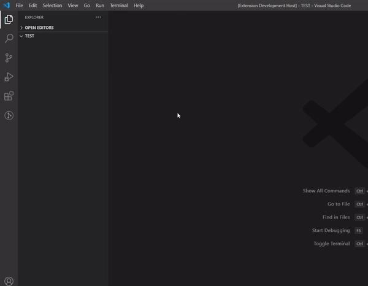
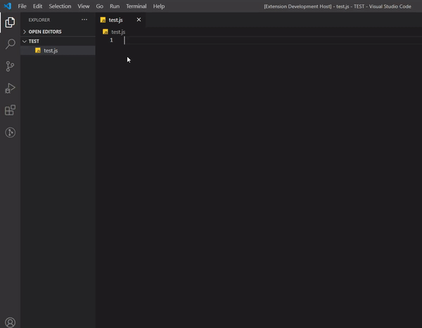
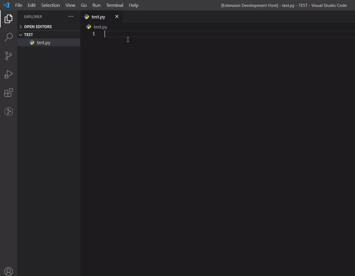

# Discord Tools

Discord Tools is a Visual Studio Code extension to code Discord bots more easily.

## Supported Languages

- [x] Python (Discord.py)
- [x] Javascript (Discord.js)
- [ ] Soon...

## Features

### Generate a template Discord bot : 
- Open the command palette (Ctrl+Shift+P)and choose : `Generate a <language> template bot (Discord.<language>)`

### Generate code easily :

#### Javascript example :
 

#### Python example :

## Contributing

Pull requests are welcome. For major changes, please open an issue first to discuss what you would like to change.

Please make sure to update tests as appropriate.

## Release Notes

### 1.0.0 (Lastest update)

Initial release

## License

This project is under [GPLv3](https://github.com/Darkempire78/Raid-Protect-Discord-Bot/blob/master/LICENSE).
