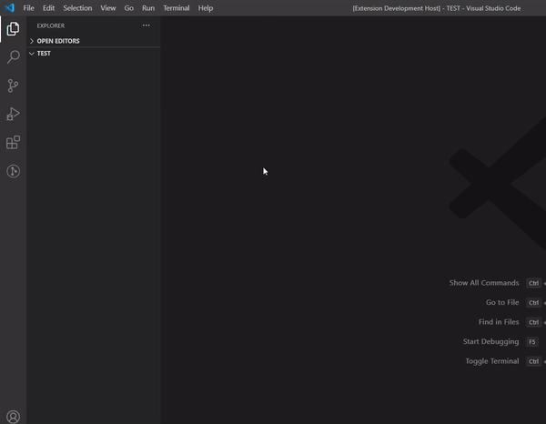
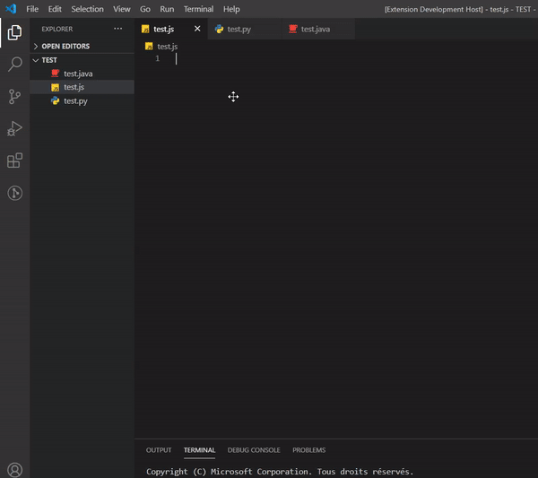
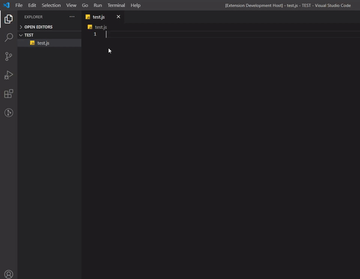
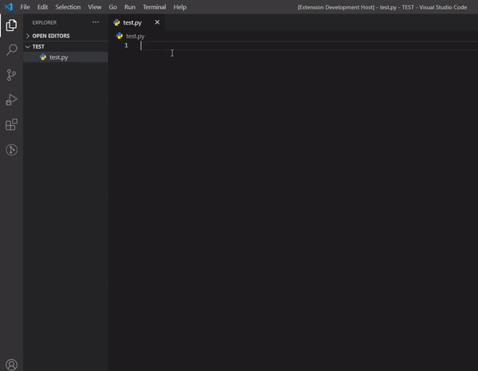
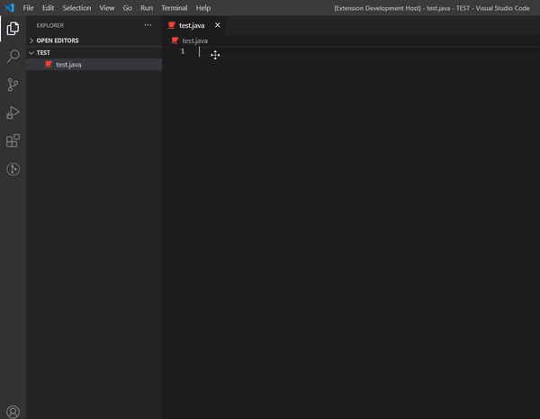

# Discord Tools

Discord Tools is a Visual Studio Code extension to code Discord bots more easily.

- **GITHUB :** https://github.com/Darkempire78/Discord-Tools
- **DOWNLOAD :** https://marketplace.visualstudio.com/items?itemName=Darkempire78.discord-tools

## Supported Languages

- [x] Javascript ([Discord.js](https://discord.js.org/#/))
- [x] Python ([Discord.py](https://discordpy.readthedocs.io/en/latest/))
- [x] Java ([JDA](https://github.com/DV8FromTheWorld/JDA))
- [ ] Soon...

## Features

### Generate a template Discord bot : 
- Open the command palette (Ctrl+Shift+P) and choose : `Generate a <language> template bot (Discord.<language>)`

### Open the Discord bot Documentation with/without a research :
- Open the command palette (Ctrl+Shift+P) and choose : `Open the Discord bot Documention`
- Shortcut : `Ctrl+Alt+D`
- Works with Discord.py, Discord.js, JDA (JDA documention does not allow to make a research)

### Generate code easily :

### Available Snippets

#### Javascript ([Discord.js](https://discord.js.org/#/)) :

- `djs.index` : Create a basic Discord bot index.js file.
- `djs.cmd` : Create a basic Discord command.
- `djs.cmd+` : Create a complex Discord command.
- `djs.embed` : Create a basic Discord embed.
- `djs.embed+` : Create a complex Discord embed.
- `djs.message` : Create a default Discord bot message event.
- `djs.guildmemberadd` : Create a default Discord bot guildMemberAdd event.
- `djs.guildmemberremove` : Create a default Discord bot guildMemberRemove event.
- `dpy.guildCreate` : Create a default Discord bot guildCreate event.
- `dpy.guildDelete` : Create a default Discord bot guildCreate event.
- **and 47 other events...**

#### Javascript Preview :

#### Python ([Discord.py](https://discordpy.readthedocs.io/en/latest/)) :

- `dpy.main` : Create a basic Discord bot main.py file.
- `dpy.cog` : Create a basic Discord cog.
- `dpy.cmd` : Create a basic Discord command.
- `dpy.cmd+` : Create a complex Discord command.
- `dpy.embed` : Create a basic Discord embed.
- `dpy.embed+` : Create a complex Discord embed.
- `dpy.onmessage` : CCreate a default Discord bot on_message event.
- `dpy.onmemberjoin` : Create a default Discord bot on_member_join event.
- `dpy.onmemberremove` : Create a default Discord bot on_member_remove event.
- `dpy.onguildjoin` : Create a default Discord bot on_guild_join event.
- `dpy.onguildremove` : Create a default Discord bot on_guild_remove event.
- **and 59 other events...**

#### Python Preview :

#### Java ([JDA](https://github.com/DV8FromTheWorld/JDA)) :

- `jda.main` : Create a basic Discord bot main function.
- `jda.cmd` : Create a basic Discord command.
- `jda.embed` : Create a basic Discord embed.
- `jda.embed+` : Create a complex Discord embed.
- `jda.onmessagereceived` : Create a default Discord bot on.

#### Java Preview :

## Contributing

Pull requests are welcome. For major changes, please open an issue first to discuss what you would like to change.

Please make sure to update tests as appropriate.

## Release Notes

### 1.1.4 (Latest update)
- new command : open the Discord bot Documentation with/without a research (works with Discord.py, Discord.js, JDA)
### 1.1.3 
- new Discord.js bot template
- new bot template generator system
- new auto package downloader
- few small updates
### 1.1.2
- 48 new Discord.js events added
- addition of capital letters to Discord.py events
- few small updates
### 1.1.1 
- change of snippet prefixes to `dpy` (Discord.py), `djs` (Discord.js) and `jda` (JDA)
- 59 new Discord.py events added
### 1.1.0
- New language supported : Java (JDA)
### 1.0.1
- Several corrections
### 1.0.0
- Initial release

## License

This project is under [GPLv3](https://github.com/Darkempire78/Raid-Protect-Discord-Bot/blob/master/LICENSE).

## Contributors

