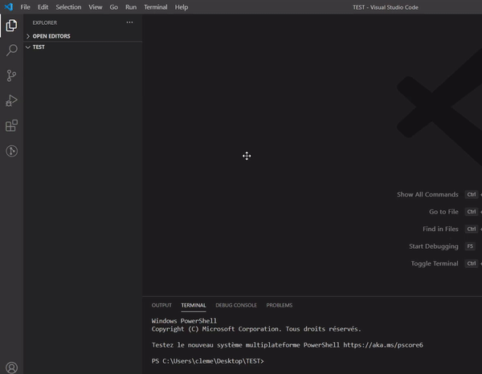

 

# Discord Tools

Discord Tools is a Visual Studio Code extension to code Discord bots more easily.

- **GITHUB :** https://github.com/Darkempire78/Discord-Tools
- **DOWNLOAD :** https://marketplace.visualstudio.com/items?itemName=Darkempire78.discord-tools

## Supported Languages

- [x] Javascript ([**Discord.js**](https://discord.js.org/#/), [**Eris**](https://abal.moe/Eris/))
- [x] Typescript ([**Harmony**](https://harmony.mod.land/))
- [x] Python ([**Discord.py**](https://discordpy.readthedocs.io/en/latest/))
- [x] Java ([**JDA**](https://github.com/DV8FromTheWorld/JDA))
- [ ] Soon...

## Index
- [**Generate a template Discord bot**](#generate-a-template-discord-bot-)
- [**Open the Discord bot Documentation with/without a research**](#open-the-discord-bot-documentation-withwithout-a-research-)
- [**Javascript snippets**](#available-snippets)
  - [Discord.js](#javascript-discordjs-)
  - [Eris](#javascript-eris-)
- [**Typescript snippets**](#typescript-harmony-)
  - [Harmony](#typescript-harmony-)
-  [**Python snippets**](#python-discordpy-)
    - [Discord.py](#python-discordpy-)
-  [**Java snippets**](#java-jda-)
    - [JDA](#java-jda-)
- [**Themes**](#discord-theme-dark-version)
- [**Functionality table**](#functionality-table)
- [**Contributing**](#contributing)
- [**Release notes**](#release-notes)
- [**License**](#license)

## Features

### Generate a template Discord bot : 
- Open the command palette (Ctrl+Shift+P) and choose : `Generate a <language> template bot (Discord.<language>)` (not available for JDA, Harmony and Eris)

⚠️ A folder must be opened in VSCode to execute this command

### Open the Discord bot Documentation with/without a research :
- Open the command palette (Ctrl+Shift+P) and choose : `Open the Discord bot Documention`
- Shortcut : `Ctrl+Alt+D`
- Works with Discord.py, Discord.js and JDA (JDA, Harmony and Eris documentions do not allow to make a research)

⚠️ A folder must be opened in VSCode to execute this command

### Generate code easily :

### Available Snippets

#### Javascript ([Discord.js](https://discord.js.org/#/)) :

- `djs.index` : Create a basic Discord bot index.js file.
- `djs.cmd` : Create a basic Discord command.
- `djs.cmd+` : Create a complex Discord command.
- `djs.embed` : Create a basic Discord embed.
- `djs.embed+` : Create a complex Discord embed.
- `djs.message` : Create a default Discord bot message event.
- `djs.guildmemberadd` : Create a default Discord bot guildMemberAdd event.
- `djs.guildmemberremove` : Create a default Discord bot guildMemberRemove event.
- `djs.guildcreate` : Create a default Discord bot guildCreate event.
- `djs.guilddelete` : Create a default Discord bot guildDelete event.
- **and 47 other events...**

#### Javascript ([Eris](https://abal.moe/Eris/)) :
- `eris.index` : Create a basic Discord bot index.js file.
- `eris.cmd` : Create a basic Discord command.
- `eris.cmd+` : Create a complex Discord command.
- `eris.embed` : Create a basic Discord embed.
- `eris.embed+` : Create a complex Discord embed.
- `eris.message` : Create a default Discord bot message event.

#### Javascript Preview :

#### Typescript ([Harmony](https://harmony.mod.land/)) :
- `hy.index` : Create a basic Discord bot index.ts file.
- `hy.cmd` : Create a basic Discord command.
- `hy.cmd+` : Create a complex Discord command.
- `hy.embed` : Create a basic Discord embed.
- `hy.embed+` : Create a complex Discord embed.
- `hy.message` : Create a default Discord bot message event.

#### Python ([Discord.py](https://discordpy.readthedocs.io/en/latest/)) :

- `dpy.main` : Create a basic Discord bot main.py file.
- `dpy.cog` : Create a basic Discord cog.
- `dpy.cmd` : Create a basic Discord command.
- `dpy.cmd+` : Create a complex Discord command.
- `dpy.embed` : Create a basic Discord embed.
- `dpy.embed+` : Create a complex Discord embed.
- `dpy.onmessage` : CCreate a default Discord bot on_message event.
- `dpy.onmemberjoin` : Create a default Discord bot on_member_join event.
- `dpy.onmemberremove` : Create a default Discord bot on_member_remove event.
- `dpy.onguildjoin` : Create a default Discord bot on_guild_join event.
- `dpy.onguildremove` : Create a default Discord bot on_guild_remove event.
- **and 59 other events...**

#### Python Preview :

#### Java ([JDA](https://github.com/DV8FromTheWorld/JDA)) :

- `jda.main` : Create a basic Discord bot main function.
- `jda.cmd` : Create a basic Discord command.
- `jda.embed` : Create a basic Discord embed.
- `jda.embed+` : Create a complex Discord embed.
- `jda.onmessagereceived` : Create a default Discord bot on.

#### Java Preview :

### Discord Theme (Dark version)
Work for Python and JavasScript
Activate the theme: `CTRL + K + CTRL + T` and choose `Discord Theme (Dark)`

#### Preview

## Functionality table

|            | Template | Doc | Doc searcher | Snippets |
|------------|:--------:|:---:|:------------:|:--------:|
| Discord.js |     ✅    |  ✅  |       ✅      |     ✅    |
| Eris       |     ❌    |  ❌  |       ❌      |     ✅    |
| Harmony    |     ❌    |  ✅  |       ❌      |     ✅    |
| Discord.py |     ✅    |  ✅  |       ✅      |     ✅    |
| JDA        |     ❌    |  ✅  |       ❌      |     ✅    |

## Discord

Join the Discord server !

## Contributing

Pull requests are welcome. For major changes, please open an issue first to discuss what you would like to change.

Please make sure to update tests as appropriate.

## Release Notes
### 1.3.3 (Latest update)
- New Discord Theme (Javascript, Python)
### 1.3.2
- Update of the Discord.js snippets
- Update of the Discord.js template
- Fix an issue with the discord-tools.openDiscordDoc command 
- Several small corrections
### 1.3.1 
- Update of the Discord.js template
- Update of the Discord.py template
### 1.3.0 
- Add the Harmony support
### 1.2.2
- Fix the python template
### 1.2.1
- Fix workspace error
- Small corrections
### 1.2.0 
- Add the Eris support
- Add the definition of python parameters
- Fix small python snippets
### 1.1.6 
- Several python snippet corrections
- Correction of the python template 
### 1.1.5 
- New snippet aliases
- New snippet choices
- Several corrections
### 1.1.4
- New command : open the Discord bot Documentation with/without a research (works with Discord.py, Discord.js, JDA)
### 1.1.3 
- New Discord.js bot template
- New bot template generator system
- New auto package downloader
- Few small updates
### 1.1.2
- 48 new Discord.js events added
- Addition of capital letters to Discord.py events
- Few small updates
### 1.1.1 
- Change of snippet prefixes to `dpy` (Discord.py), `djs` (Discord.js) and `jda` (JDA)
- 59 new Discord.py events added
### 1.1.0
- New language supported : Java (JDA)
### 1.0.1
- Several corrections
### 1.0.0
- Initial release

## License

This project is under [GPLv3](https://github.com/Darkempire78/Raid-Protect-Discord-Bot/blob/master/LICENSE).
